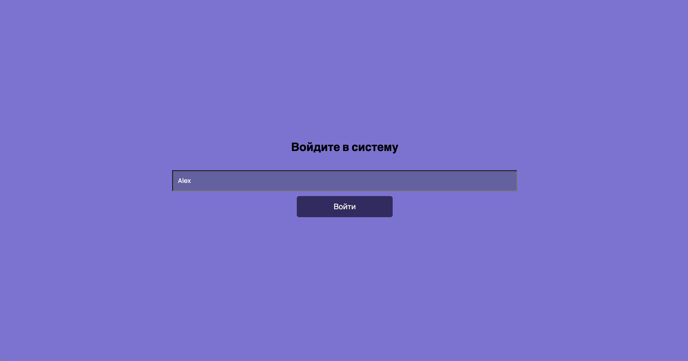
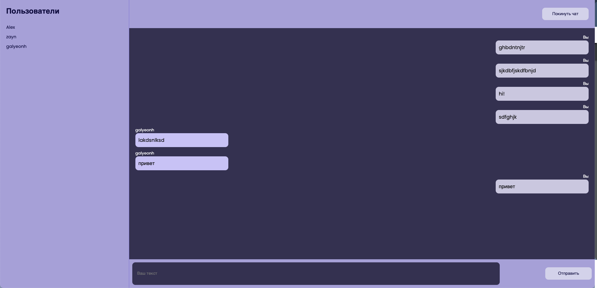

# Web-chat

Пользователь заходит на страницу, представляется системе,
далее может пролистывать историю сообщений (например, последние 100 или с
подгрузкой более старых), отправлять свои сообщения.

## Стек технологий

    


## Структура проекта

```tree
.
├── LICENSE
├── ReadME.md
├── client
│   ├── README.md
│   ├── package-lock.json
│   ├── package.json
│   ├── public
│   │   ├── favicon.ico
│   │   ├── index.html
│   │   ├── logo192.png
│   │   ├── logo512.png
│   │   ├── manifest.json
│   │   └── robots.txt
│   └── src
│       ├── App.js
│       ├── components
│       │   ├── ChatBar.js
│       │   ├── ChatBody.js
│       │   ├── ChatFooter.js
│       │   ├── ChatPage.js
│       │   └── Home.js
│       ├── index.css
│       ├── index.js
│       └── reportWebVitals.js
└── server
    ├── index.js
    ├── package-lock.json
    ├── package.json
    └── request.rest
```

## Использование
1. Склонировать репозиторий
    ```bash
    https://github.com/1vokahsu/Web-chat.git
    ```
3. Создайте БД
    ```sql
    CREATE TABLE users (
    id SERIAL PRIMARY KEY,
    user_name TEXT,
    created_at TIMESTAMP DEFAULT CURRENT_TIMESTAMP
    );
    CREATE TABLE messages (
        id SERIAL PRIMARY KEY,
        user_id INT,
        message TEXT,
        created_at TIMESTAMP DEFAULT CURRENT_TIMESTAMP,
        FOREIGN KEY (user_id) REFERENCES users(id) 
    );
    ```
2. Перейти в папку `server`, установить зависимости, запустить код
    ```bash
    cd sever/
    npm i
    npm start
    ```
3. Открыть новый терминал, перейти в папку `client`, установить зависимости, запустить код
    ```bash
    cd client/
    npm i
    npm start
    ```
4. Открыть в браузере web-чат по адресу `http://localhost:3000` или `http://127.0.0.1:3000`


5. Чтобы остановить код, находясь в терминале, нажмите сочетание клавиш `Ctrl+C`


## Участие

Участие в Web-chat приветствуется! Будь то запросы на добавление новых функций, сообщения об ошибках или добавление кода, пожалуйста, не стесняйтесь отправлять запрос на обновление или открывать issue в репозитории.

## License

Этот проект лицензирован по лицензии MIT - подробности смотрите в файле [LICENSE](LICENSE).

## Участники проекта
[](https://github.com/1vokahsu)
